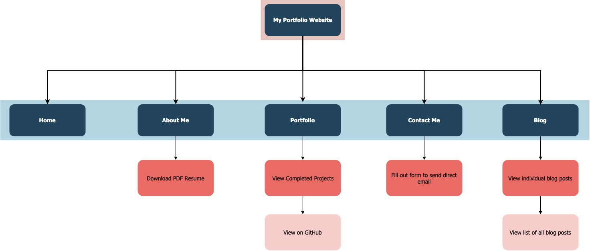
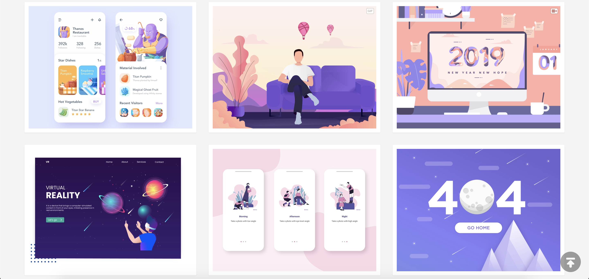
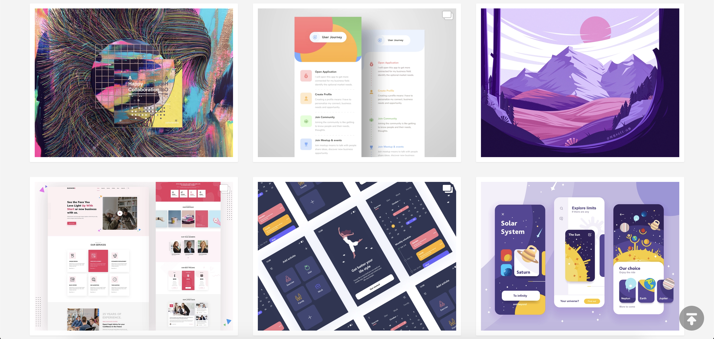
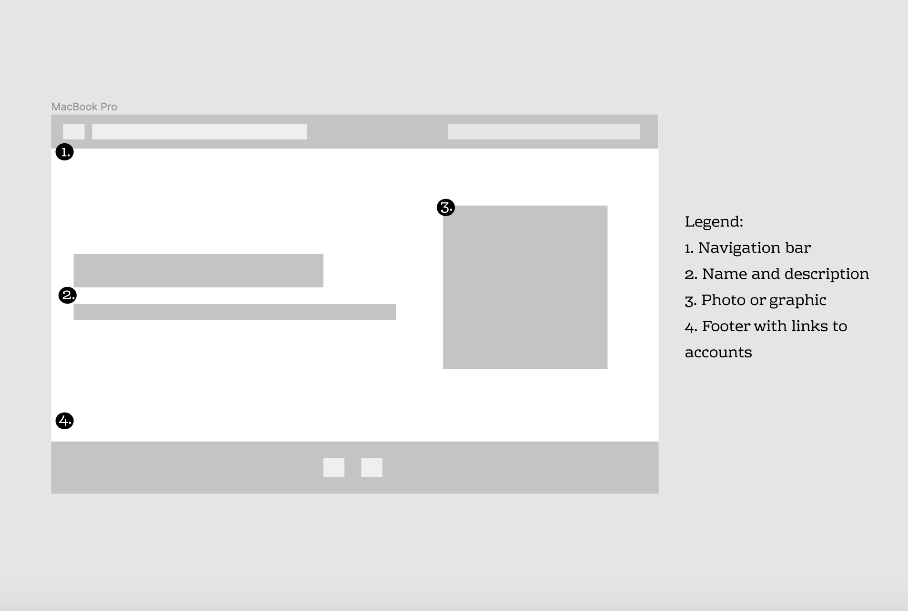
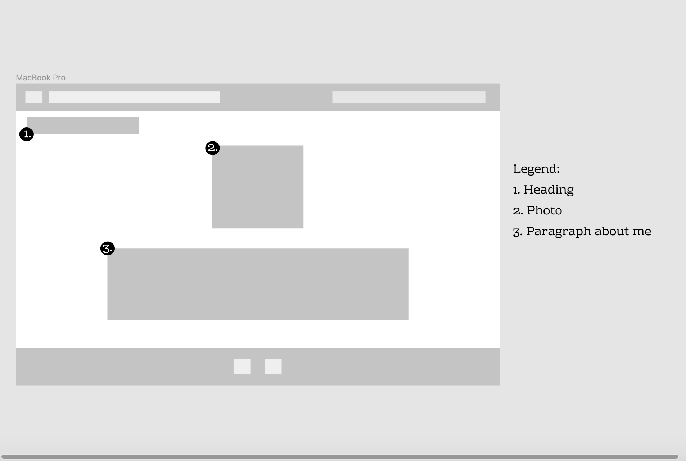
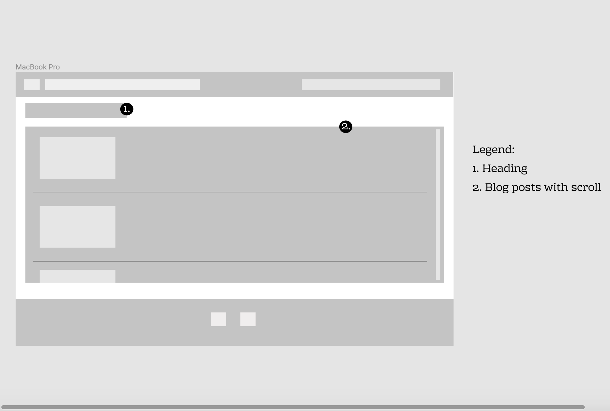
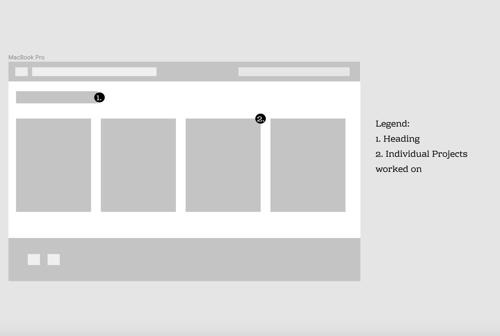
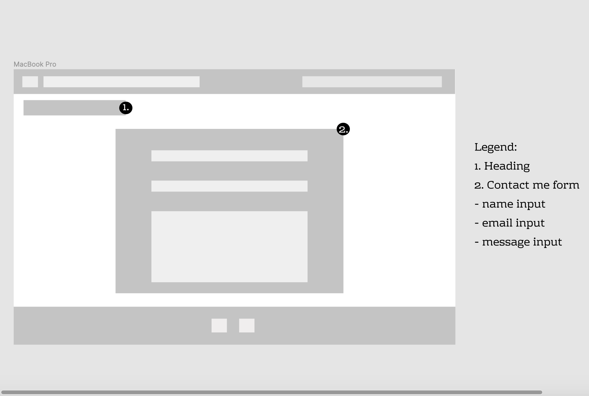

# Website Portfolio

[Website Link](https://www.melissabykersma.netlify.com)

[GitHub Repo Link](https://www.https://github.com/MelB-24/portfolio-website)

## Purpose

The purpose of this assignment was to use our skills with HTML and CSS to create a portfolio website. We were to use a minimum of 4 HTML pages to create this website and add CSS to style. 

This assignment highlighted which skills I was lacking with HTML, such as flexbox. By the end of creating this website I believe my flexbox skills have improved. I felt more comfortable creating the pages and went back and rebuilt the pages that I first did with more flexbox. 

I had a lot of trouble in terms of designing the layout and themes of the website as I do not have much of a design flair. I originally wanted to go with a purple and coral design but after fiddling around for a long time with the little details I ended up changing the design to be a much more workable design with my skills. I much more enjoyed working with the HTML side of things and the more basic layout functions of CSS. 

## Functionality/Features

The features of my site include the following.

- Navbar - this remains the same over each page and is always at the top. When viewing the website on mobile this switches to a drop down menu instead of fixed tabs at the top.

- Footer - contains my links to social media and always remains at the bottom.

- Home Page - contains an intro and a generic photo.

- About Me - has a photo of myself and a small paragraph about me. Also has a link to download a pdf of my resume. 

- Blog Page - Sample blog posts with placeholder text.

- Portfolio Page - contains the projects I have worked on

- Contact me Page - has a form to fill out to be able to email me directly. 

## Sitemap

## Screenshots

### Dribbble Image Gallery

### Wireframes

**Home Page**

**About Me Page**

**Blog Page**

**Portfolio Page**

**Contact Me Page**

## Target Audience

The target audience of this assignment and website is future employers and fellow peers.

## Tech Stack (e.g. html, css, deployment platform, etc)

The tech used to create this website is HTML and pure CSS. The website is deployed on Netlify via the GitHub repo. 